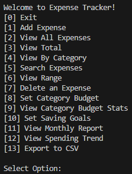
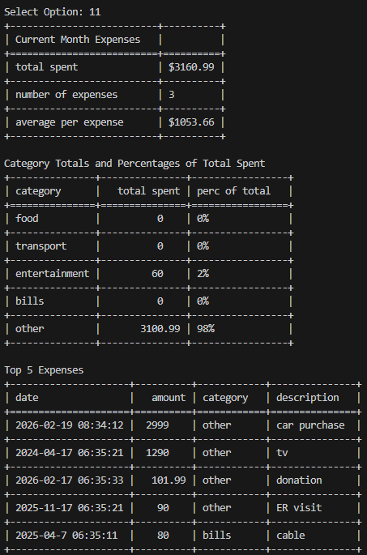
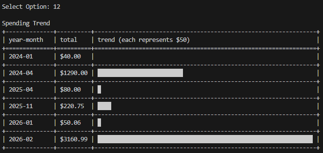
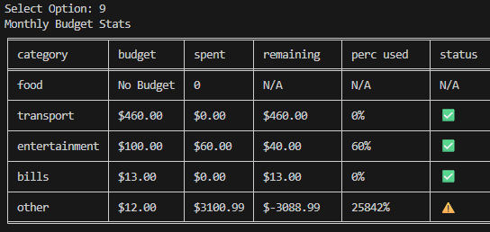

markdown

# Expense Tracker

A command-line expense tracking application. Data is stored in a JSON file to save data between sessions. I built this program to strengthen my understanding of multiple JSON file data storage, produce reports, calculate trends, exporting to CSV file, as well as using third party libraries in Python.

## Features
- Add and delete expenses. User can enter expenses with amount, category, description, and automatic timestamp.
- Budget and savings tracking. User can set budgets and savings goal.
- Reports and Trends. User can view monthly summaries, top expenses, spending trends, and total spent in each category.
- Export expenses to CSV file.
- Automatic save/load functionality. Creates JSON file and or empty global lists if any files are missing or problematic.
- Input validation. Rejects invalid user inputs and provides feedback.

## How to Run
```
bash
git clone https://github.com/andreigurd/expense-tracker
cd expense-tracker
pip install tabulate
python expense-tracker.py
```
**Prerequisites:**
- Python 3.x
- pip packages: `tabulate`.

## 📸 Screenshots





## 🧠 What I Learned
- Exporting to CSV file was valuable as it provided a cleaner more readable format than JSON for this application.
- How to run reports and spending trends. The challenge of this was working with graphical characters to show budget status.
- How to save and load different JSON files for data that needed to be saved between runs. I would have approached the method differently and consolidate the saved data to a single JSON file. 


## 🔮 Future Improvements
- Add recurring expenses.
- Improve savings goal tracking with automatic alert when expenses are entered.
- Add and track income.
- Organize the menu to group the view functions at the end of menu.

## 🤝 Contributing
This is a learning project, but feedback is welcome!


